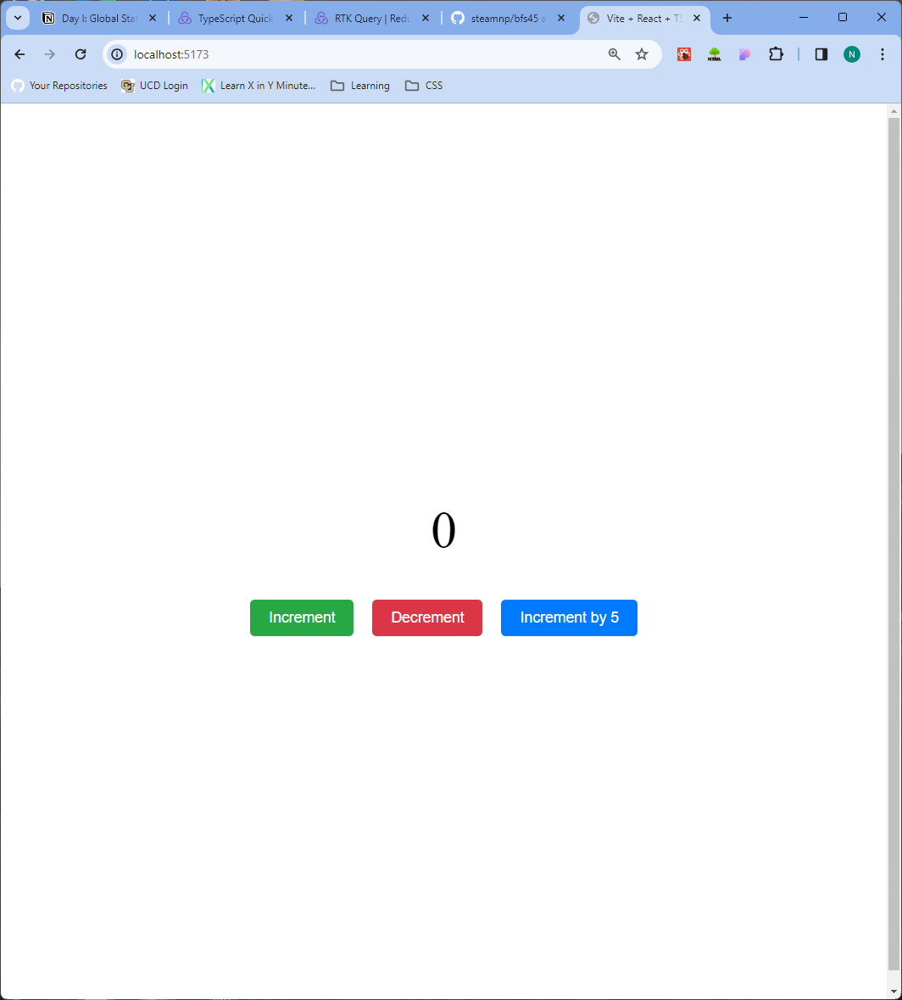

## Counter App

## Overview

This is a simple counter application built using React and Redux Toolkit. It allows users to increment, decrement, or increment the counter by a specified amount(5 in this case).
The `createSlice` function from Redux Toolkit is used in this to manage client states in this application.

